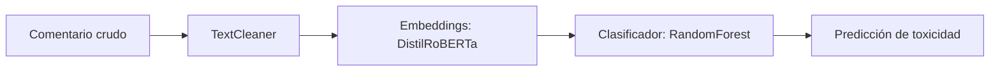

# Sistema de Detección de Comentarios Tóxicos con LLMs


Este sistema clasifica comentarios como tóxicos o no tóxicos utilizando **embeddings generados por un modelo LLM (DistilRoBERTa)**, seguido de un clasificador tradicional (`RandomForestClassifier`).  
Está basado en la competencia de Kaggle:  
🔗 [Jigsaw Unintended Bias in Toxicity Classification](https://www.kaggle.com/competitions/jigsaw-unintended-bias-in-toxicity-classification)

---

## Estructura del Proyecto

```text
ToxicCommentDetection/
├── data/
│   ├── raw/                # Datos originales (deben colocarse manualmente)
│   └── processed/          # Datos procesados automáticamente
├── models/                 # Modelos entrenados y predicciones
├── src/
│   ├── modules/            # Módulos personalizados (TextCleaner, ContextAnalyzer, etc.)
│   ├── config.py           # Configuración general del sistema
│   ├── dependency_checker.py
│   ├── evaluation.py       # Métricas y análisis
│   ├── main.py             # Punto de entrada principal
│   ├── preprocessing.py    # Preprocesamiento y balanceo
│   └── test_cases.py       # Casos de prueba críticos
├── .gitignore
├── requirements.txt
├── setup_resources.py      # Script para descarga inicial (si aplica)
└── README.md               # Este archivo
```

---

## Requisitos Previos

- Python **3.10** o superior
- Instalar las dependencias necesarias ejecutando:

```bash
pip install -r requirements.txt
```

- Descargar los archivos de datos desde la competencia en Kaggle y colocarlos en la carpeta `data/raw/`:

```text
data/raw/
├── train.csv
├── test.csv
├── identity_individual_annotations.csv
├── sample_submission.csv
```

> Asegúrate de que los nombres de los archivos sean exactamente los mencionados arriba.

---

## 🚀 Instrucciones de Ejecución

1. **Clonar el repositorio:**

```bash
git clone https://github.com/tuusuario/ToxicCommentDetection.git
cd ToxicCommentDetection
```

2. **Instalar dependencias:**

```bash
pip install -r requirements.txt
```

3. **Colocar los archivos de datos** en `data/raw/` (ver sección anterior).

4. **Ejecutar el sistema:**

```bash
python src/main.py
```

---

## 📦 Resultados Generados

- Modelo entrenado con embeddings LLM:  
  `models/llm_toxicity_model.joblib`

- Predicciones para envío en Kaggle:  
  `models/kaggle_submission.csv`

- Precisión crítica esperada:  
  > Mayor al **90%** en casos ambiguos (irónicos, sarcásticos, o con identidades sensibles)

---

## 🔍 Flujo de Trabajo del Sistema



---

## 🧠 Detalles Técnicos

- **Embeddings**: `distilroberta-base` usando la librería `sentence-transformers`
- **Clasificador**: `RandomForestClassifier` con balanceo de clases
- **Procesamiento optimizado**: para CPU (soporta chunks grandes)
- **Robustez**: el sistema detecta sarcasmo, negaciones, e identidades sensibles sin reglas manuales

---

## 👥 Autores

- Andrey Camilo Gonzalez Caceres  
- Hugo Mojica Angarita  
- Laura Paez Cifuentes  
---

Universidad Distrital Francisco José de Caldas  
Systems Analysis & Design - 2025

## Enlace a la competencia

[Jigsaw Unintended Bias in Toxicity Classification – Kaggle](https://www.kaggle.com/competitions/jigsaw-unintended-bias-in-toxicity-classification)


Universidad Distrital Francisco José de Caldas  
Systems Analysis & Design - 2025
