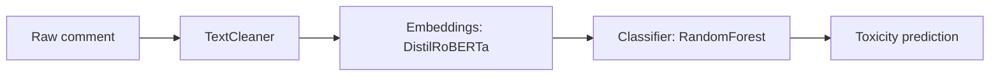

# Toxic Comment Detection System with LLMs


This system classifies comments as toxic or non-toxic using **embeddings generated by an LLM model (DistilRoBERTa)**, followed by a traditional classifier (`RandomForestClassifier`).  
It is based on the Kaggle competition:  
🔗 [Jigsaw Unintended Bias in Toxicity Classification](https://www.kaggle.com/competitions/jigsaw-unintended-bias-in-toxicity-classification)

---

## Project Structure

```text
ToxicCommentDetection/
├── data/
│   ├── raw/                # Original data (must be placed manually)
│   └── processed/          # Automatically generated processed data
├── models/                 # Trained models and predictions
├── src/
│   ├── modules/            # Custom modules (TextCleaner, ContextAnalyzer, etc.)
│   ├── config.py           # Global configuration
│   ├── dependency_checker.py
│   ├── evaluation.py       # Metrics and analysis
│   ├── main.py             # Main entry point
│   ├── preprocessing.py    # Preprocessing and balancing
│   └── test_cases.py       # Critical test cases
├── .gitignore
├── requirements.txt
├── setup_resources.py      # Optional setup script
└── README.md               # This file

```

---

## Prerequisites

- Python **3.10** or higher
- Install the required dependencies:

```bash
pip install -r requirements.txt
```

- Download the competition files from Kaggle and place them in the `data/raw/` folder:

```text
data/raw/
├── train.csv
├── test.csv
├── identity_individual_annotations.csv
├── sample_submission.csv
```

> Ensure the filenames match exactly as shown.

---

## Execution Instructions

1. **Clone the repository:**

```bash
git clone https://github.com/yourusername/ToxicCommentDetection.git
cd ToxicCommentDetection
```

2. **Install dependencies:**

```bash
pip install -r requirements.txt
```

3. **Place the dataset files in** `data/raw/` as described above.

4. **Run the system:**

```bash
python src/main.py
```

---

## Generated Outputs

- Trained LLM-based model:  
  `models/llm_toxicity_model.joblib`

- Predictions for Kaggle submission:  
  `models/kaggle_submission.csv`

- Expected critical-case accuracy:
  > Above **90%** in ambiguous cases (sarcasm, irony, identity-based content)

---

## System Workflow



---

## Technical Details

- **Embeddings**: `distilroberta-base` via the `sentence-transformers` library
- **Classifier**: `RandomForestClassifier` with class balancing
- **Optimized processing**: CPU-friendly, supports large datasets
- **Robustness**: Capable of detecting sarcasm, negations, and identity references without manual rules

---

## Authors

- Andrey Camilo Gonzalez Caceres  
- Hugo Mojica Angarita  
- Laura Paez Cifuentes  
---


## Link

[Jigsaw Unintended Bias in Toxicity Classification – Kaggle](https://www.kaggle.com/competitions/jigsaw-unintended-bias-in-toxicity-classification)
https://www.kaggle.com/code/hugomojicaangarita/datatoxicity

Universidad Distrital Francisco José de Caldas  
Systems Analysis & Design - 2025
